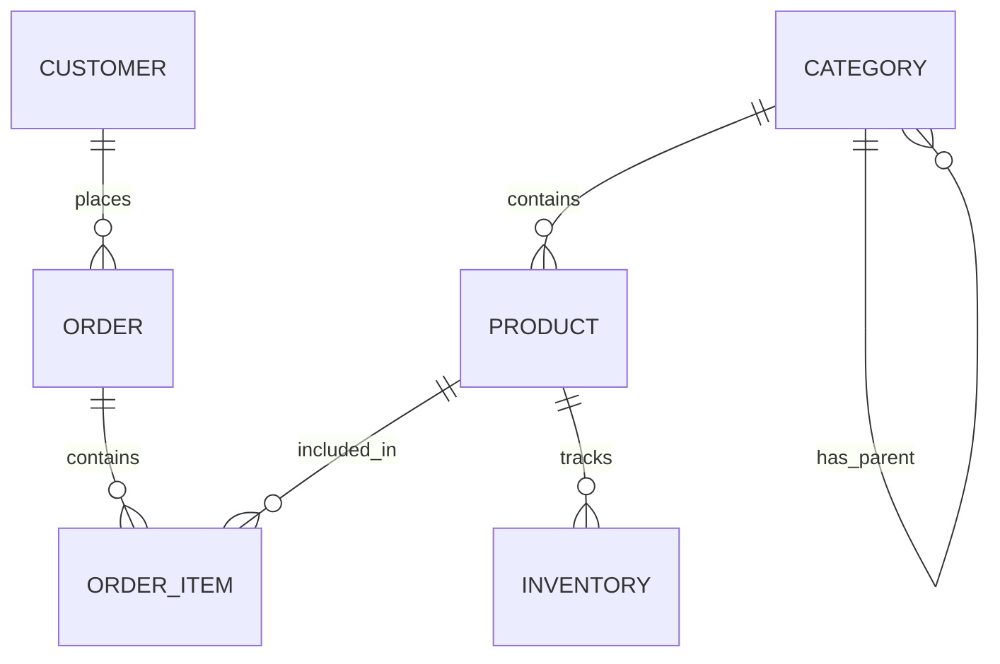
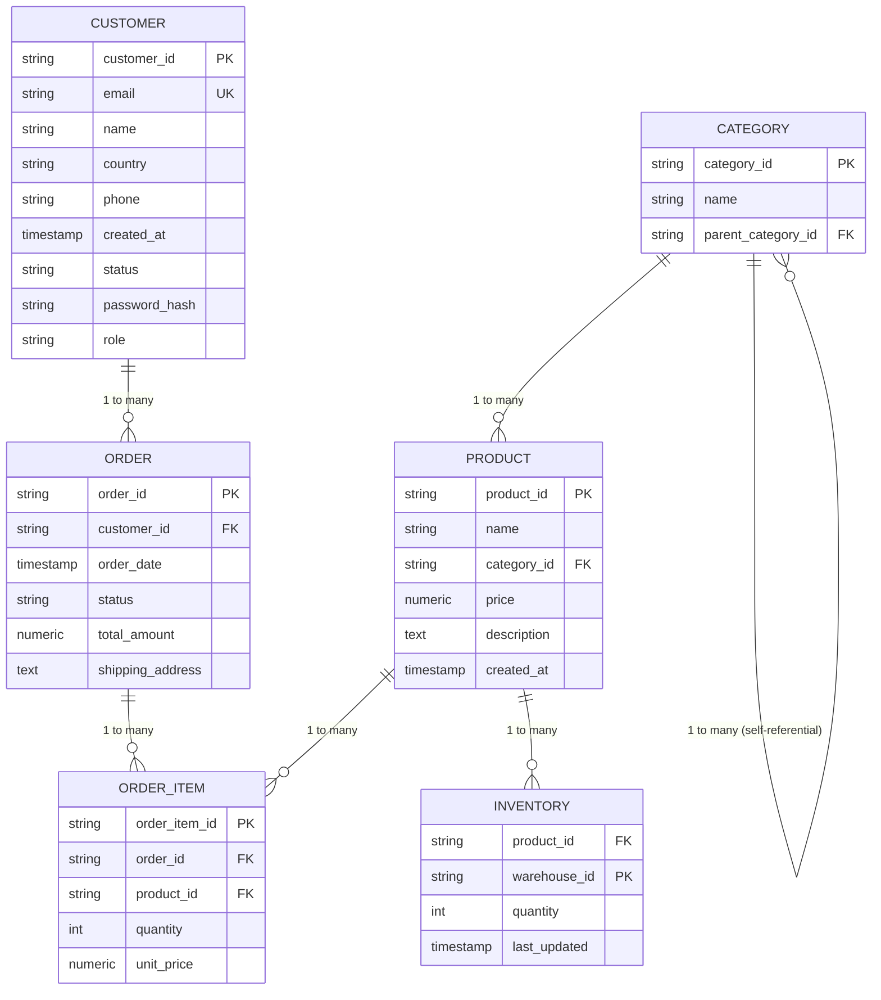

# Database Schema

## Entity Relationship Diagram

## Detailed ER Diagram

## Table Descriptions

### customers

| Column | Type | Constraints | Description |
|--------|------|-------------|-------------|
| `customer_id` | TEXT | PK | Unique identifier (UUID) |
| `email` | TEXT | UNIQUE, NOT NULL | User email address |
| `name` | TEXT | NOT NULL | Full name |
| `country` | TEXT | NULL | Country of residence |
| `phone` | VARCHAR(50) | NULL | Contact phone number |
| `created_at` | TIMESTAMP | NOT NULL | Account creation timestamp |
| `status` | VARCHAR(50) | NULL | Account status |
| `password_hash` | TEXT | NULL | bcrypt hash of password |
| `role` | VARCHAR(20) | NOT NULL, CHECK | `customer` or `admin` |

**Indexes:**
- `idx_customers_email` on `email`
- `idx_customers_role` on `role`

### categories

| Column | Type | Constraints | Description |
|--------|------|-------------|-------------|
| `category_id` | TEXT | PK | Unique identifier (UUID) |
| `name` | TEXT | NOT NULL | Category name |
| `parent_category_id` | TEXT | FK (self) | Parent category for hierarchy |

**Indexes:**
- `idx_categories_parent` on `parent_category_id`

**Relationships:**
- Self-referential: parent_category_id references categories(category_id)

### products

| Column | Type | Constraints | Description |
|--------|------|-------------|-------------|
| `product_id` | TEXT | PK | Unique identifier (UUID) |
| `name` | TEXT | NOT NULL | Product name |
| `category_id` | TEXT | FK -> categories | Associated category |
| `price` | NUMERIC | NOT NULL, CHECK > 0 | Product price |
| `description` | TEXT | NULL | Product description |
| `created_at` | TIMESTAMP | NOT NULL | Creation timestamp |

**Indexes:**
- `idx_products_category` on `category_id`
- `idx_products_price` on `price`

**Relationships:**
- FK: category_id -> categories(category_id) with DELETE RESTRICT

### orders

| Column | Type | Constraints | Description |
|--------|------|-------------|-------------|
| `order_id` | TEXT | PK | Unique identifier (UUID) |
| `customer_id` | TEXT | FK -> customers | Customer who placed order |
| `order_date` | TIMESTAMP | NOT NULL | Order timestamp |
| `status` | TEXT | NULL | Order status (pending, shipped, etc.) |
| `total_amount` | NUMERIC | NOT NULL, CHECK >= 0 | Order total |
| `shipping_address` | TEXT | NULL | Delivery address |

**Indexes:**
- `idx_orders_customer` on `customer_id`
- `idx_orders_date` on `order_date`

**Relationships:**
- FK: customer_id -> customers(customer_id) with DELETE CASCADE

### order_items

| Column | Type | Constraints | Description |
|--------|------|-------------|-------------|
| `order_item_id` | TEXT | PK | Unique identifier (UUID) |
| `order_id` | TEXT | FK -> orders | Parent order |
| `product_id` | TEXT | FK -> products | Product ordered |
| `quantity` | INT | NOT NULL, CHECK >= 0 | Quantity ordered |
| `unit_price` | NUMERIC | NOT NULL, CHECK >= 0 | Price at time of order |

**Indexes:**
- `idx_order_items_order` on `order_id`
- `idx_order_items_product` on `product_id`

**Relationships:**
- FK: order_id -> orders(order_id) with DELETE CASCADE
- FK: product_id -> products(product_id) with DELETE RESTRICT

### inventory

| Column | Type | Constraints | Description |
|--------|------|-------------|-------------|
| `product_id` | TEXT | FK -> products | Product (part of PK) |
| `warehouse_id` | VARCHAR(50) | NOT NULL (part of PK) | Warehouse identifier |
| `quantity` | INT | NOT NULL, CHECK >= 0 | Stock quantity |
| `last_updated` | TIMESTAMP | NULL | Last stock update |

**Composite Primary Key:** (product_id, warehouse_id)

**Indexes:**
- `idx_inventory_product` on `product_id`
- `idx_inventory_warehouse` on `warehouse_id`

**Relationships:**
- FK: product_id -> products(product_id) with DELETE CASCADE

## Index Strategy

### Primary Indexes
- All tables have primary key indexes on their ID columns

### Secondary Indexes

| Table | Index | Columns | Purpose |
|-------|-------|---------|---------|
| customers | idx_customers_email | email | Login lookups |
| customers | idx_customers_role | role | Admin queries |
| products | idx_products_category | category_id | Category filtering |
| products | idx_products_price | price | Price range queries |
| orders | idx_orders_customer | customer_id | Customer orders |
| orders | idx_orders_date | order_date | Date range queries |
| order_items | idx_order_items_order | order_id | Order details |
| order_items | idx_order_items_product | product_id | Product in orders |
| inventory | idx_inventory_product | product_id | Stock lookup |
| categories | idx_categories_parent | parent_category_id | Hierarchy traversal |

### Covering Indexes
- `idx_orders_customer_date` (customer_id, order_date) for efficient date-range queries per customer

## Data Integrity

### Foreign Key Constraints
- `products.category_id` -> `categories.category_id` (DELETE RESTRICT - cannot delete category with products)
- `orders.customer_id` -> `customers.customer_id` (DELETE CASCADE - orders deleted with customer)
- `order_items.order_id` -> `orders.order_id` (DELETE CASCADE)
- `order_items.product_id` -> `products.product_id` (DELETE RESTRICT - cannot delete product in orders)
- `inventory.product_id` -> `products.product_id` (DELETE CASCADE)
- `categories.parent_category_id` -> `categories.category_id` (DELETE SET NULL)

### Check Constraints
- `products.price > 0`
- `orders.total_amount >= 0`
- `order_items.quantity >= 0`
- `order_items.unit_price >= 0`
- `inventory.quantity >= 0`
- `customers.role IN ('customer', 'admin')`

## Migrations

All schema changes are managed via SQL migrations in `backend/internal/migrations/`:

| Migration | Description |
|-----------|-------------|
| 001_initial_schema | Core tables and relationships |
| 002_indexes | Performance indexes |
| 003_add_roles | Customer role column |
| 004_add_password_hash | Authentication support |