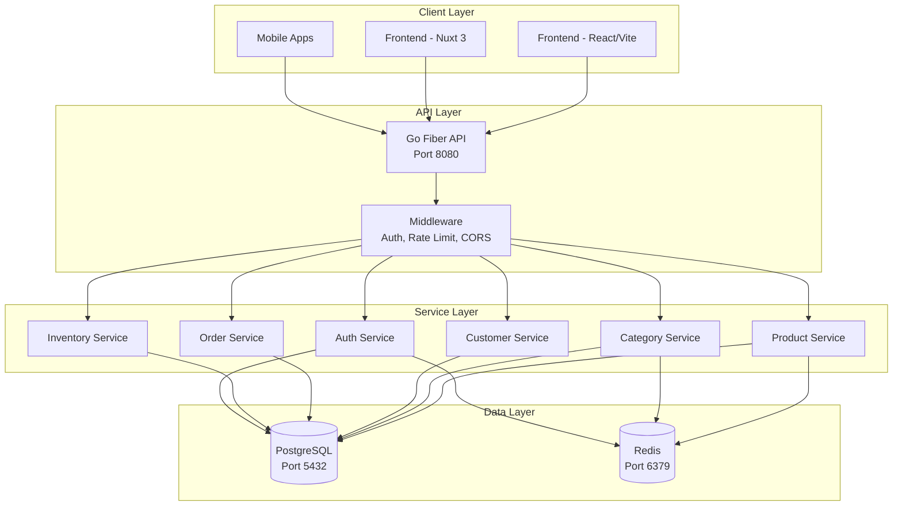
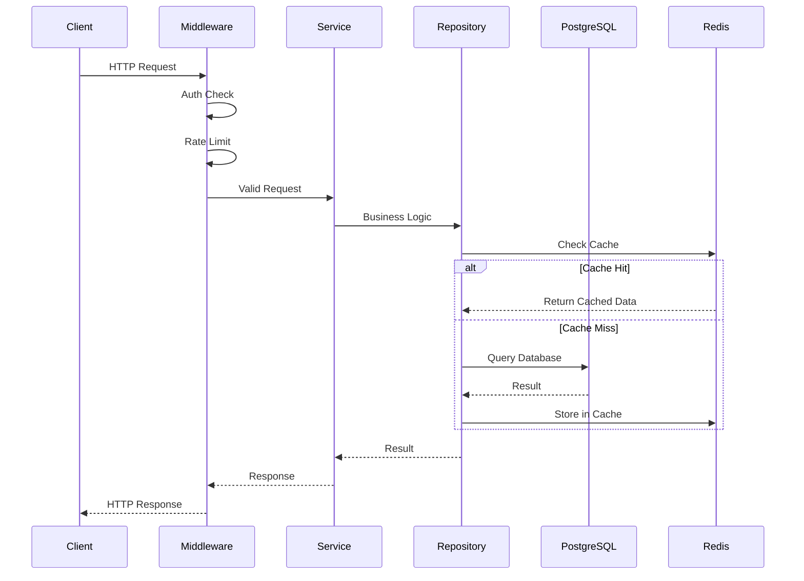
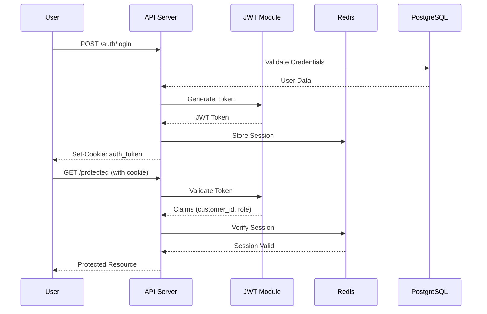

# System Overview

## High-Level Architecture



## Components

### Frontend Layer
- **React + Vite**: Primary frontend (port 5173)
- **Nuxt 3**: Experimental alternative frontend
- **Tailwind CSS**: Styling framework

### API Layer (Go Fiber)
- **Framework**: Fiber v3 (Express-like API)
- **Port**: 8080 (configurable via PORT env)
- **Middleware**:
  - Authentication (JWT validation)
  - Authorization (role-based access)
  - Rate limiting (general + login-specific)
  - CORS (configurable origins)
  - Request logging
  - Security headers

### Service Layer
| Service | Description |
|---------|-------------|
| Product | CRUD operations, caching |
| Category | Hierarchy management |
| Customer | Profile, orders, CLV |
| Order | Order creation, ownership validation |
| Inventory | Stock, analytics |
| Auth | JWT issuance, validation, sessions |

### Data Layer
- **PostgreSQL**: Primary data store
- **Redis**: Session storage, query caching

## Data Flow

### Request Flow



### Authentication Flow



## Technology Choices

| Component | Technology | Rationale |
|-----------|------------|-----------|
| API Framework | Fiber v3 | Fast, Express-like, mature |
| Database | PostgreSQL | ACID compliance, JSON support |
| Cache | Redis | Speed, session storage |
| Auth | JWT + Redis | Stateless, scalable |
| Query Builder | goqu | Type-safe SQL |
| Password | bcrypt | Secure, proven |
| Migrations | golang-migrate | Version control for DB |
| Containers | Podman/Docker | DevOps consistency |

## Infrastructure

### Development
- Local PostgreSQL (port 5432)
- Local Redis (port 6379)
- Go Fiber on port 8080

### Production (Containerized)
```yaml
services:
  app:
    ports: [8080:8080]
  psql_bp:
    ports: [5432:5432]
  redis:
    ports: [6379:6379]
```

### Network
- Bridge network: `blueprint`
- All services communicate via internal network
- Only API port exposed to host